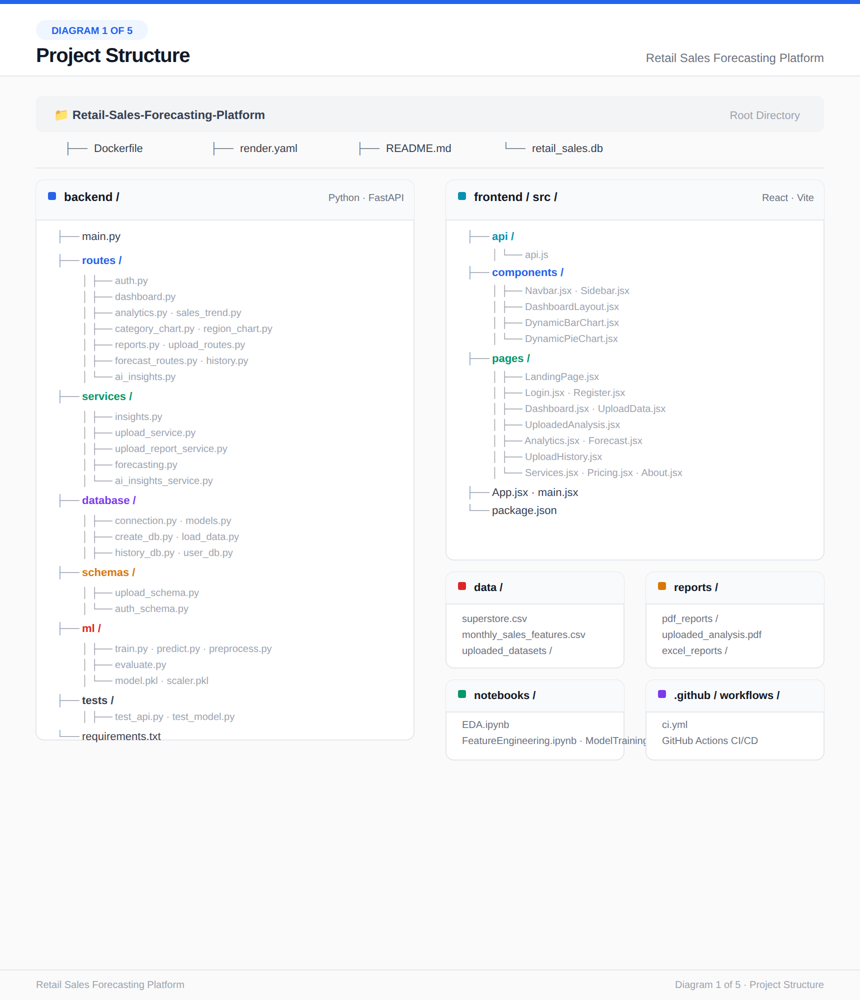
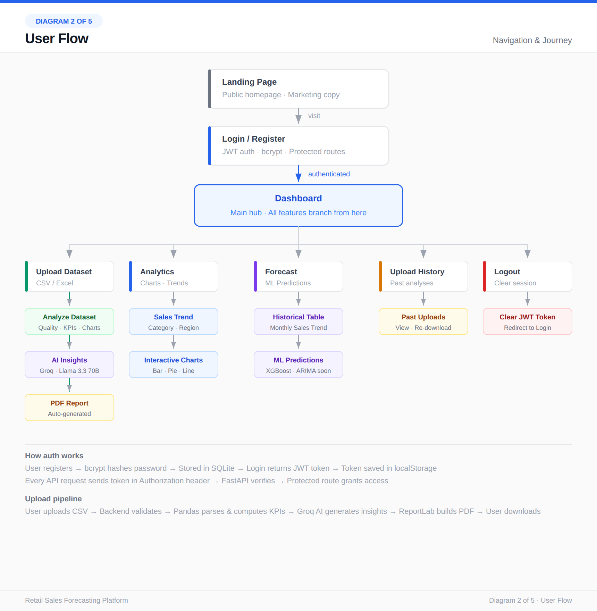
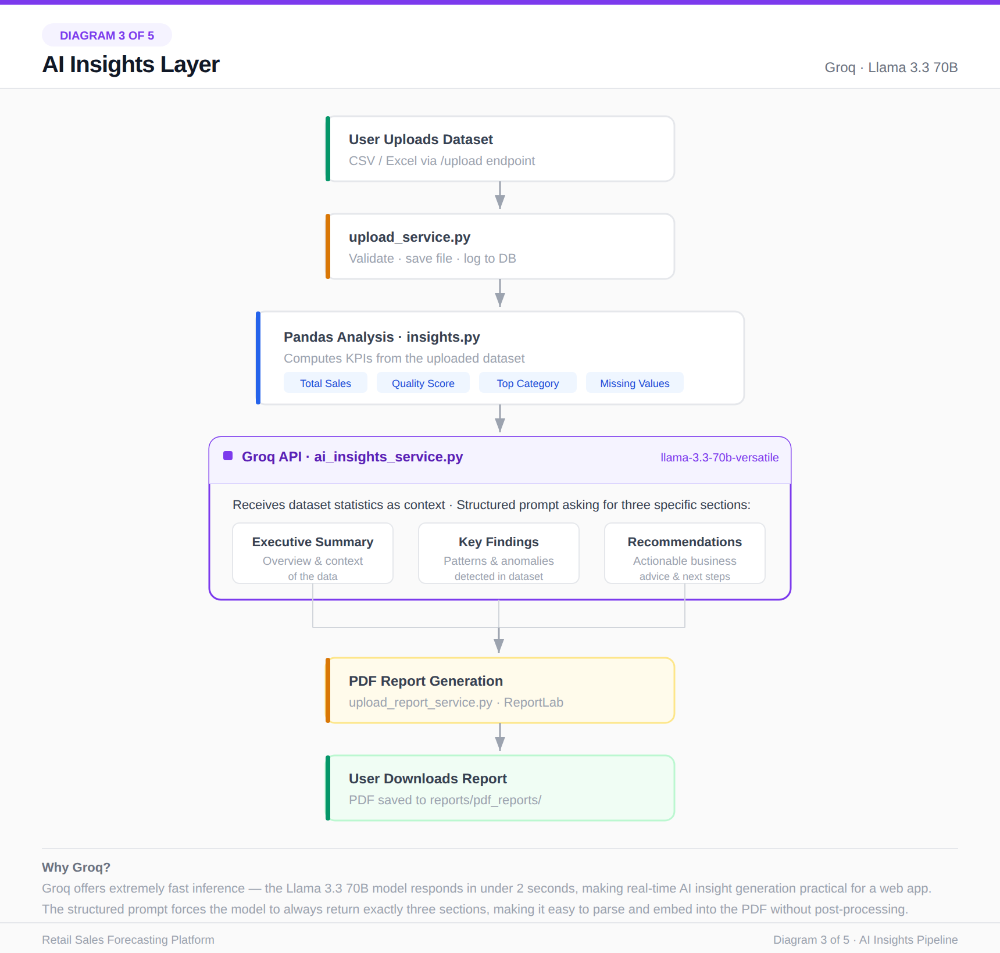
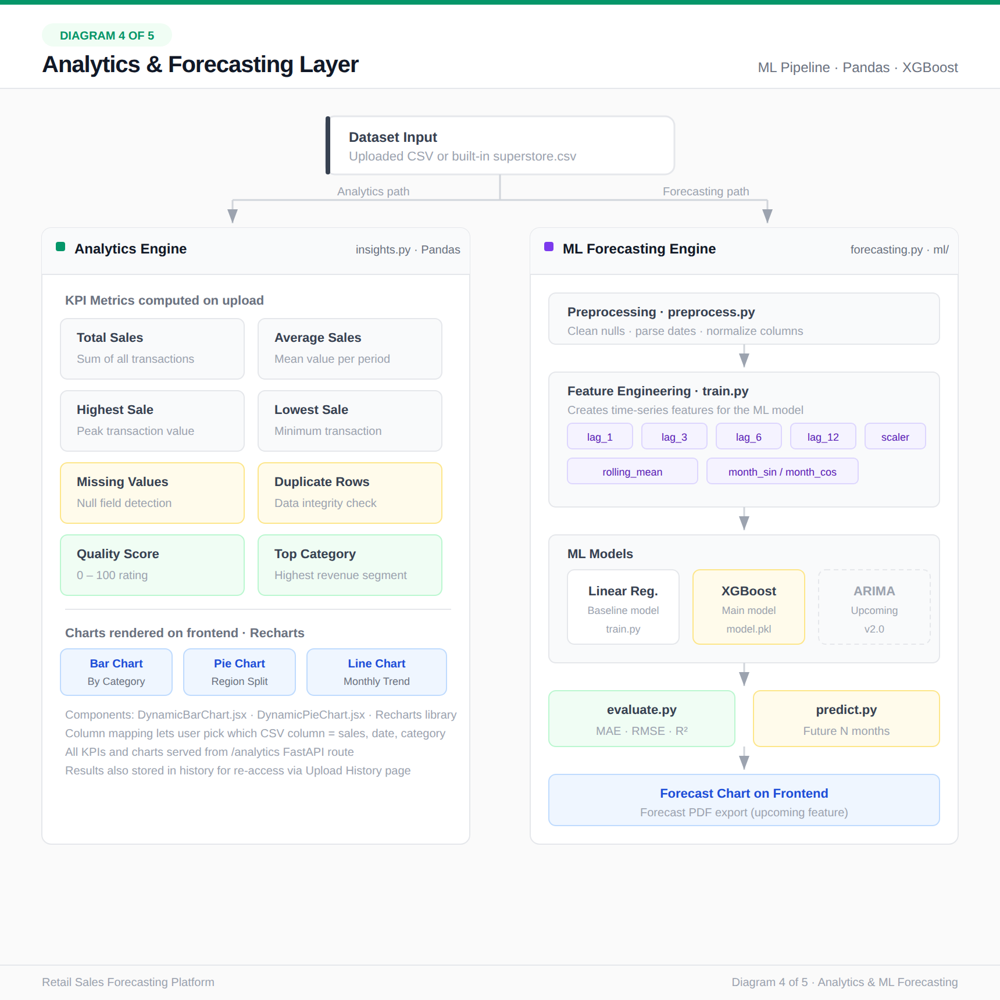
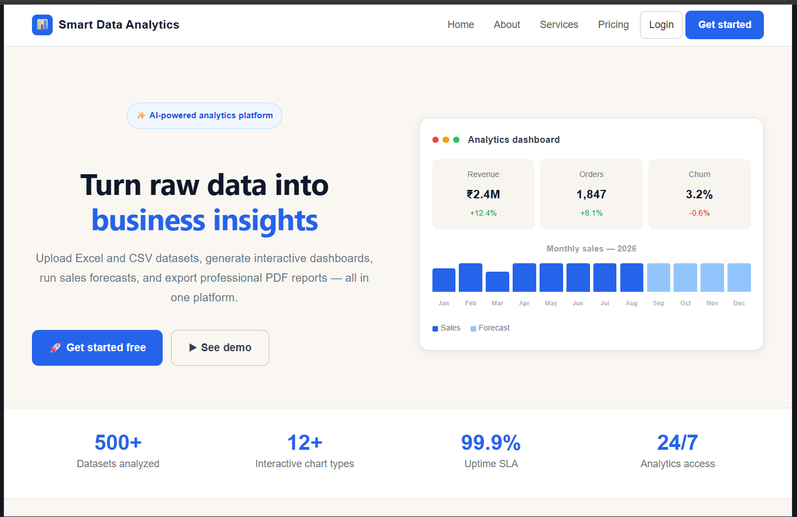
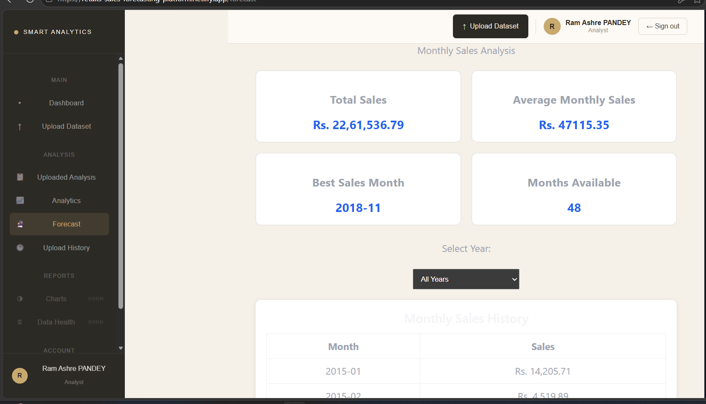
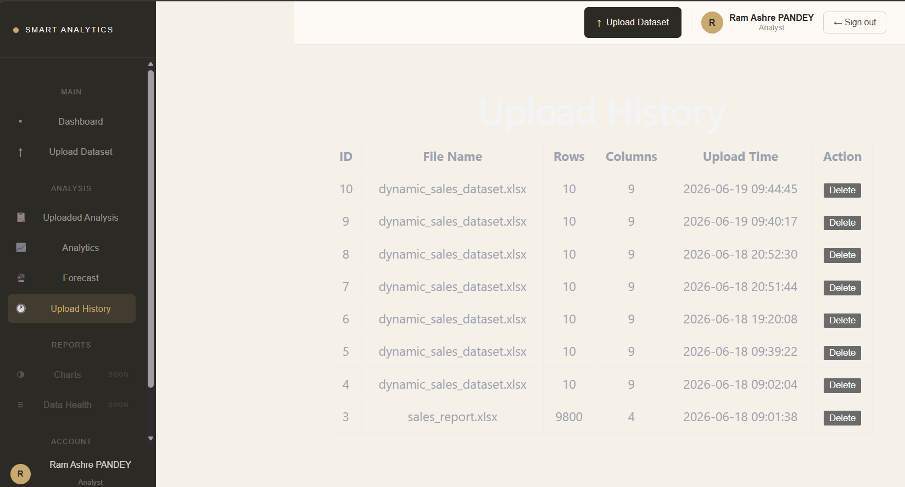
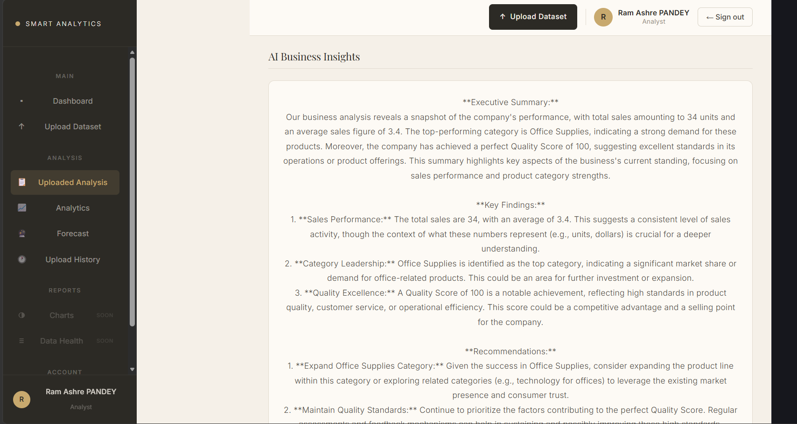

<div align="center">

# 📊 Retail Sales Forecasting Platform

**AI-Powered Retail Analytics & Sales Forecasting Platform**

Built with FastAPI, React, Machine Learning, and Groq AI — featuring automated insights, interactive dashboards, and a full CI/CD deployment pipeline.

[](https://retails-sales-forecasting-platform.netlify.app/)
[](https://github.com/SAJLENDRAPANDEY/Retail-Sales-Forecasting-Platform)


</div>

---

## 📌 Overview

**Retail Sales Forecasting Platform** is a full-stack data analytics application that lets users upload retail sales datasets and instantly receive **automated data quality checks, interactive visualizations, AI-generated business insights, and machine learning–based sales forecasts.**

The platform combines a **FastAPI backend**, a **React + Vite frontend**, a **Pandas/XGBoost ML pipeline**, and the **Groq Llama 3.3 70B API** for natural-language business insights — all containerized with Docker and deployed through an automated CI/CD pipeline.

🔗 **Live Demo:** [retails-sales-forecasting-platform.netlify.app](https://retails-sales-forecasting-platform.netlify.app/)
📂 **Source Code:** [github.com/SAJLENDRAPANDEY/Retail-Sales-Forecasting-Platform](https://github.com/SAJLENDRAPANDEY/Retail-Sales-Forecasting-Platform)

---

## 📑 Table of Contents

- [Features](#-features)
- [Tech Stack](#-tech-stack)
- [System Architecture](#-system-architecture)
- [User Flow](#-user-flow)
- [AI Insights Pipeline](#-ai-insights-pipeline)
- [Analytics & Forecasting Pipeline](#-analytics--forecasting-pipeline)
- [Screenshots](#-screenshots)
- [Local Setup](#-local-setup)
- [CI/CD](#-cicd)
- [Future Enhancements](#-future-enhancements)
- [Author](#-author)

---

## ✨ Features

| | Feature | Description |
|---|---------|--------------|
| 🔐 | **User Authentication** | Secure JWT-based login & registration with bcrypt password hashing |
| 📤 | **Dataset Upload** | Upload retail sales data in CSV or Excel format |
| 🧩 | **Dynamic Column Mapping** | Map any dataset's columns to sales, date & category fields |
| 🧹 | **Automated Data Quality Analysis** | Detects missing values, duplicates & computes a quality score |
| 📊 | **Interactive Dashboard** | Real-time KPIs and charts powered by Recharts |
| 🗂️ | **Category-wise Analytics** | Sales breakdown by category, region & time period |
| 🤖 | **AI-Generated Business Insights** | Executive summaries & recommendations via Groq's Llama 3.3 70B |
| 📄 | **PDF Report Generation** | Auto-generated, downloadable analysis reports |
| 🕓 | **Upload History Tracking** | Revisit and re-download past analyses |
| 📈 | **Sales Forecasting** | ML-based future sales predictions using XGBoost |
| ⚙️ | **CI/CD Pipeline** | Automated testing & build validation on every push |
| 🐳 | **Docker Deployment** | Fully containerized for consistent, portable deployment |

---

## 🛠 Tech Stack

<table>
<tr>
<td valign="top" width="25%">

**Frontend**
- React.js
- Vite
- Recharts

</td>
<td valign="top" width="25%">

**Backend**
- FastAPI
- Pandas
- SQLAlchemy

</td>
<td valign="top" width="25%">

**Machine Learning**
- Scikit-Learn
- XGBoost
- Feature Engineering

</td>
<td valign="top" width="25%">

**AI / DevOps**
- Groq API (Llama 3.3 70B)
- SQLite
- Docker
- GitHub Actions
- Render

</td>
</tr>
</table>

---

## 🏗 System Architecture

High-level breakdown of the backend services, frontend structure, and supporting directories.



---

## 🔄 User Flow

How a user moves through the app — from landing page, through authentication, to the dashboard and its five core features.



---

## 🧠 AI Insights Pipeline

How an uploaded dataset is transformed into a structured, AI-generated business report using Groq's Llama 3.3 70B model.



---

## 📈 Analytics & Forecasting Pipeline

The dual pipeline that powers both the descriptive analytics engine and the ML-based forecasting engine.



---

## 🖼 Screenshots

> Add your screenshots inside `docs/screenshots/` and reference them below.

| Dashboard | Analytics |
|---|---|
|  |  |

| Forecast | Upload History |
|---|---|
|  |  |

| AI Insights |
|---|
|  |

---

## 🚀 Local Setup

### 1. Clone the repository
```bash
git clone https://github.com/SAJLENDRAPANDEY/Retail-Sales-Forecasting-Platform.git
cd Retail-Sales-Forecasting-Platform
```

### 2. Backend setup
```bash
cd backend
pip install -r requirements.txt
uvicorn backend.main:app --reload
```

### 3. Frontend setup
```bash
cd frontend
npm install
npm run dev
```

### 4. Run with Docker (optional)
```bash
docker build -t retail-sales-forecasting .
docker run -p 8000:8000 retail-sales-forecasting
```

---

## ⚙️ CI/CD

This project uses **GitHub Actions** to automatically:

- ✅ Install backend & frontend dependencies
- ✅ Run API tests (`test_api.py`)
- ✅ Run ML model tests (`test_model.py`)
- ✅ Validate the production build

Workflow file: [`.github/workflows/ci.yml`](.github/workflows/ci.yml)

---

## 🔮 Future Enhancements

- [ ] ARIMA-based forecasting alongside XGBoost
- [ ] "Chat with your dataset" — conversational data Q&A
- [ ] MLflow experiment tracking
- [ ] Forecast PDF export
- [ ] Role-based access control (Admin / Analyst / Viewer)

---

## 👤 Author

**Sajlendra Pandey**

[](https://www.linkedin.com/in/sajlendra-pandey-37378627b/)
[](https://sajlendrapandey.netlify.app/)
[](https://github.com/SAJLENDRAPANDEY)

---

<div align="center">

⭐ If you found this project useful, consider giving it a star on GitHub!

</div>
